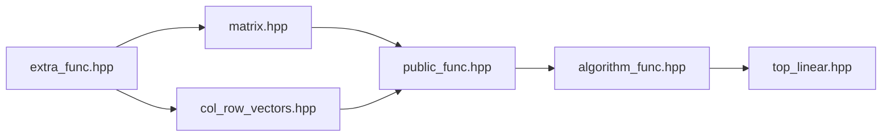

# 线性代数——CasYYY


## 介绍：
- 这是主要由自己编写的线性代数库，包括矩阵，向量，和算法。也可以只包括矩阵或行列向量。

## 功能：
1. 定义矩阵类。
2. 定义行列向量。
3. 进行矩阵，向量，以及相互间的加减乘除。以及切割和链接矩阵。
4. 进行矩阵的数值算法（目前支持求逆，QR分解，PLU分解，计算行列式，高斯消元等）
5. 进行快速幂运算（非主要用途，请自行判断是否要使用）

## 主要文件：
|头文件名称|核心内容|状态|
|:---:|:---:|:---:|
|[matrix.hpp](/my_math/linear_algebra/matrix.hpp)|定义了矩阵基本类，以及它们们的运算|持续更新|
|[col_row_vectors.hpp](/my_math/linear_algebra/col_row_vectors.hpp)|定义了行向量和列向量，以及他们的运算|持续更新|
|[public_func.hpp](/my_math/linear_algebra/public_func.hpp)|定义了矩阵和向量的一些计算|持续更新|
|[algorithm_func.hpp](/my_math/linear_algebra/algorithm_func.hpp)|定义了矩阵的数值运算的算法|持续更新|
|[extra_func.hpp](/my_math/linear_algebra/extra_func.hpp)|一些额外的辅助函数|长期稳定|
|[top_linear.hpp](/my_math/linear_algebra/top_linear.hpp)|作为整个库的入口|长期稳定|
|[???]()|???|???|

*主要为这六个头文件，如果你想要一个总集头文件，可以从作者处获得。如果你意外得到了一个与众不同的头文件，请自行探索启用方式和用法。*

## 安装

### 得到原文件
```bash
git clone https://github.com/mir12lyy-cloud/my_things.git
cd my_things/my_math/linear_algebra
```

### 环境要求  
- C++ 17 以上 （GCC 8+, Clang 6+, VS2017 15.7+）

### 头文件依赖  



**请确保在单独使用某些功能时，囊括了正确的头文件。**  

### 导入项目  
由于本库为纯**头文件模板库**，所以简单复制整个`/linear_algebra`到项目即可。当然也可根据需要只复制几个头文件。

**具体操作（在CMake中）**  
```CMake
include_directories(项目路径)
```

**配置头文件** 请在编译器中确定好你的头文件的位置。

**在代码中引用**
```C++
#include "top_linear.hpp"
#include <iostream>
int main(){
    my_math::Matrix<int> a_matrix(3, 3, 3);
    std::cout << a_matrix << "\n";
}
```

### 快速上手
**示例**
```C++
#include "top_linear.hpp"
#include <iostream>
int main(){
    my_math::Matrix<int> myMatrix(3ULL, 3, {1, 3, 2, 2, 0, 3, 4, 1, 1});
    std::cout << my_math::det(myMatrix) << "\n";
    std::cout << myMatrix << "\n";
    std::cout << my_math::transpose(myMatrix) << "\n";
    std::cout << myMatrix.at(0, 0) << "\n";
    my_math::Matrix B = my_math::basicGaussianElimination(myMatrix);
    std::cout << B << "\n";
    std::cout << myMatrix.childrenMatrix({0, 1}, {0, 2}) << "\n";
    std::cout << my_math::getInverse(myMatrix) << "\n";
    for(const auto& i : my_math::getPLU(myMatrix)) std::cout << i << "\n";
}
```
**输出**
```text
1 2 4
3 0 1
2 3 1

4 1 1
1
4 1 1
0 2.75 1.75
0 0 2.81818

1 2
2 3
-0.0967742 -0.0322581 0.290323
0.322581 -0.225806 0.0322581
0.0645161 0.354839 -0.193548

0 0 1
1 0 0
0 1 0

1 0 0
0.25 1 0
0.5 -0.181818 1

4 1 1
0 2.75 1.75
0 0 2.81818
```

## 功能特性
1. **矩阵定义和功能**
```C++
my_math::Matrix<int> mat1 //默认构造
my_math::Matrix<int> mat2(3, 2) //构造一个3 * 2的矩阵，不填充值
my_math::Matrix<int> mat3(3, 2, 3) //构造一个3 * 2的矩阵，填充值3
my_math::Matrix<int> mat4(3, 2, {1, 2, 3}) //构造一个3 * 2矩阵，填充1,2,3，之后全部填充0
my_math::Matrix<int> mat5(3, false, 3); //构造一个3 * 3的非对角矩阵，填充3.
my_math::Matrix<int> mat6(3, {1, 2, 3}); //构造一个对角矩阵，对角线填充1, 2, 3.
mat1.assign(3, 2, 3) //分配mat1为3 * 2矩阵，填充3。
auto mat = mat2 + mat3; //矩阵加法
//...
```
2. **向量定义和运算**
```C++
my_math::rowVector<int> vec1(3, {1, 2, 3}); //定义行向量[1, 2, 3]；
my_math::colVector<int> vec2(3, {1, 2, 3}); //定义列向量
int dot = vec1 * vec2; //向量数乘。
my_math::Matrix<int> mat1 = vec2 * vec1; //向量的矩阵乘。
```

3. **矩阵的数值算法**
```C++
my_math::Matrix<int> myMatrix(3ULL, 3, {1, 3, 2, 2, 0, 3, 4, 1, 1});
double det1 = det(myMatrix); //求行列式
auto mat2 = getQR(myMatrix); //进行QR分解 
```

**其他的可以自行翻阅源代码.hpp，不再讲述。**

## 未来的目标：
1. 重载运算符>>，以支持`std::cin`输入。
2. 进行命名和函数上的重构，统一命名风格。
3. 拟引入矩阵视图`my_math::matrix_view`，优化一些算法的实现。
4. 引入SVD奇异值分解。
...

## 贡献
这个库主要记载自己学线性代数的过程，如果你有任何的改进建议，欢迎提交Issue和Pull Request!

## 许可
本项目使用 [MIT许可证](/LICENSE)，任何人可以自由使用，保留原作者信息即可。

## 联系我
- 邮箱：huangjinyangyang@hotmail.com
- QQ：671489684
- Github：@mir12lyy-cloud
