# GUI点名器 ——CasYYY


一个简单的带GUI界面的点名器（GUI界面设计使用了AI和生成工具，后端代码和前后端的函数链接则是自己在学习后完成的）

## 简介
- 这是一个简单的点名器，可以载入班级文件，进行点名，可以指定性别点名。可以输出日志。

## 功能
1. 载入班级文件进行点名。
2. 可以根据**性别**进行点名。
3. 可以输出一个日志（**命名为name_output.txt， 在根目录中**）

## 主要文件
- `core.py` 负责点名的逻辑
- `window.py` 上层点名的GUI，调用 `core.py` 进行点名，返回结果
- `点名器.exe` 封装好的exe（使用Pyinstaller），可以直接使用

## 安装

### 环境要求

- Python 3.13+ **（如果你需要修改代码的情况下）**

### 依赖的库（如果你需要修改代码）
- Tkinter
- os
- random

### 步骤
1. **克隆仓库**
```bash
git clone https://github.com/mir12lyy-cloud/my_things.git
```
2. **进入项目内部**
```bash
cd selectNames
```

- **注：如果只是使用这个点名器，直接下载`点名器.exe`即可。**

3. **打开EXE**  
    本程序已经打包好了EXE文件，打开 `点名器.exe` 即可上手使用。
    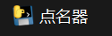

- **如果你需要观看源码，修改源码，或者嵌入源码，则可以在IDE中打开 `core.py` 和 `window.py`。**
    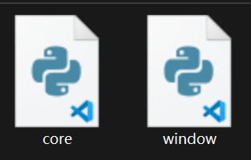

- **`/example` 文件夹只是示例用的图片，不影响实际使用。**

## 界面介绍
- 如果界面打开正常，那么你应该能看到这个界面：
    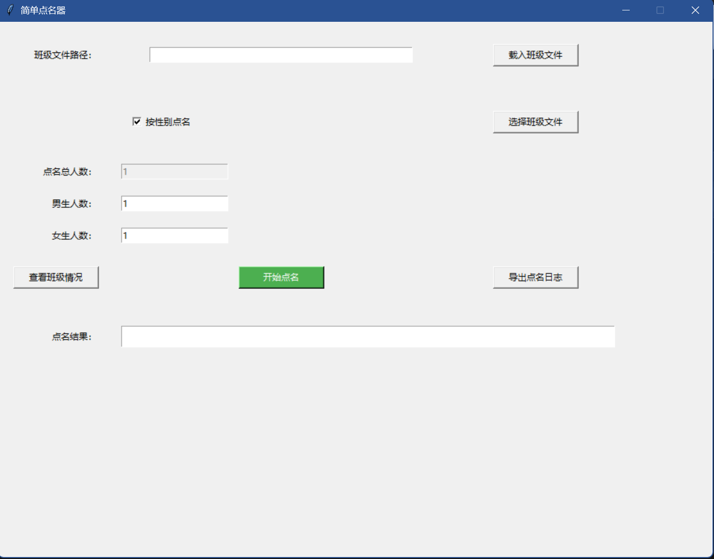
**接下来是对于界面的介绍。**
1. **文件选择：**
   **班级文件路径** 会记录你的班级文件路径，之后传递给后面点名的函数。
   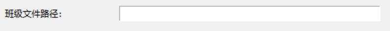
   **选择班级文件** 会调出一个文件选择框，之后可以在文件框里选一个 **\.txt文件** 载入
   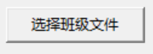
   （按钮）
   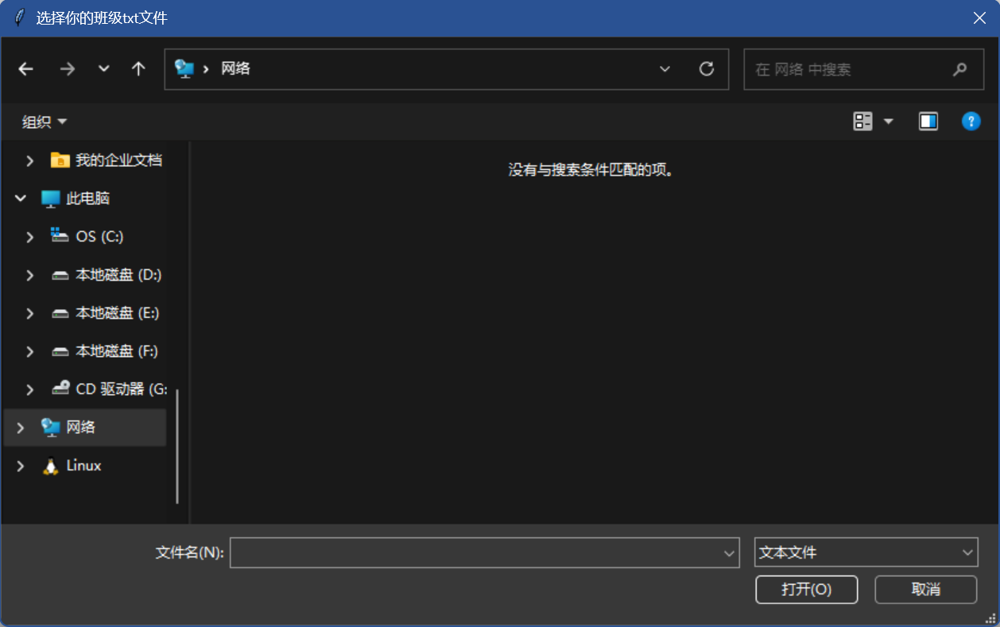
   （文件选择）
   **注：选择文件后不会一并载入班级，需要后面手动载入！**
2. **载入班级**
  选择文件后，需要点击 **载入班级文件** 才能进行班级的载入。
  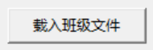
  之后程序会通过载入结果输出窗口。载入失败，没有文件或文件不合规则输出如下：
  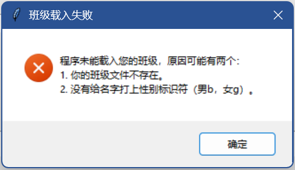
  输出以下则表示成功：
  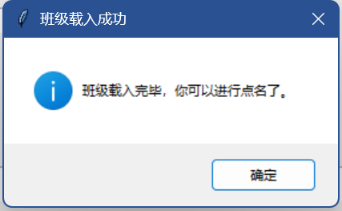
  **只有载入成功班级，进行后续的点名，日志导出，查看班级的操作！**
3. **查看班级信息（请确保你载入了班级，否则弹出未载入班级的错误！）**
   可以通过 **查看班级情况** 按钮查看班级情况，此按钮会输出 **班级人数，班级男生数，班级女生数**。
   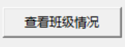
   示例：
   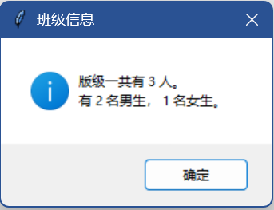
4. **点名准备（里面所有值默认为1）**
   在点名的输入框内，有 **按性别点名，点名总人数，点名男生数，点名女生数** 四个可以改变的东西，点名时会读取输入框的内容，判断是否合规之后开始点名（指定性别后，会读取**点名男生数，点名女生数**，未指定性别则读取**点名总人数**）。**按性别点名** 勾选后，**点名总人数**会被禁用，**点名男生数，点名女生数** 会被启用，反之亦然。
   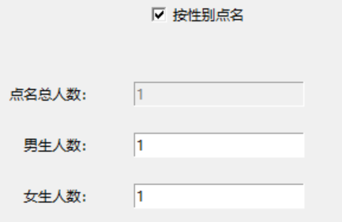
   （启用按性别点名）
   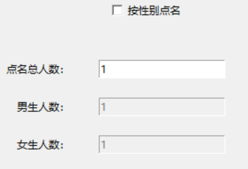
   （禁用按性别点名）
5. **点名（请确保你载入了班级，否则弹出未载入班级的错误！）**
   输入完人数后，就可以开始点名了！点名时会检查输入的合法性（是否超人数，男女生数），如果输入不合规，会出现错误。
   
   **（开始你的点名！）**
   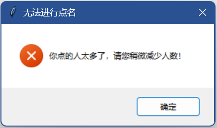
   （输入不合规）
   如果输入正常，会提示成功，返回结果提示。
   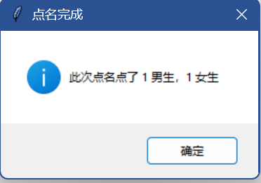
   （根据性别）
   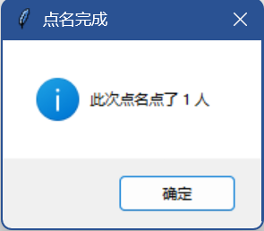
   （不根据性别）
   之后再输出框输出结果：
   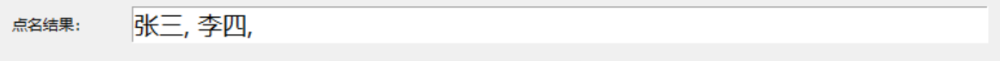
6. **输出日志（请确保你载入了班级，否则弹出未载入班级的错误！）**
    如果你想检查学生活跃度，点名状况等，可以选择 **导出点名日志** 输出日志。
    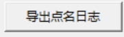
    之后会提示日志输出 **（输出会在根目录输出）**
    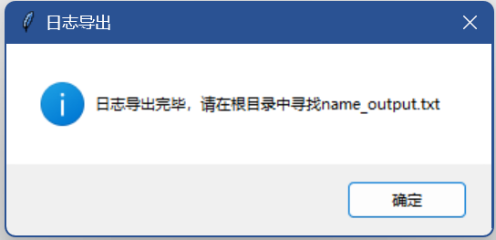
    之后请在**根目录**寻找 `name_output.txt`，点击打开即可查看班级点名情况。
    
    （文件）
    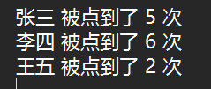
    （预览）

## 使用步骤

1. **创建班级文件**
    首先你需要创建一个你自己的班级文件，文件内部名字格式如下 **“中文名字+性别标识符（男b，女g）”**，每一行一个名字。（文件命名随意）
    **示例** :
    ```text
    张三b
    李四g
    王五b
    ```
    **如果没有班级文件，或者班级文件不合规矩，是无法点名的！**
2. **载入班级文件**
   载入，初始化，班级文件比较简单。  
   **先确保你创建的文件是合规的**，找到**选择班级文件**的按钮，选择你的**班级txt文件**（你也可以手动输入路径），之后点击 **载入班级文件** ，载入成功就可以进行点名了。
3. **输入点名信息**
   输入你是否需要按性别点名，点名人数，点名男女数。请确保点的人数不要超出班级的人数，否则会报错。**查看班级信息** 可帮助你查看班级的具体状况。
4. **点名**
   确认无误后，点击**开始点名**，即可进行点名，之后会输出弹窗和结果。
5. **输出日志（需要的话）**
   点击**导出点名日志**即可，具体结果在上面已经讲述，不再赘述。

## 贡献
这个点名器是我的一个小工具，如果你有任何的改进建议，欢迎提交Issue和Pull Request!

## 许可
本项目使用 [MIT许可证](/LICENSE)，任何人可以自由使用，保留原作者信息即可。

## 联系我
- 邮箱：huangjinyangyang@hotmail.com
- QQ：671489684
- Github：@mir12lyy-cloud